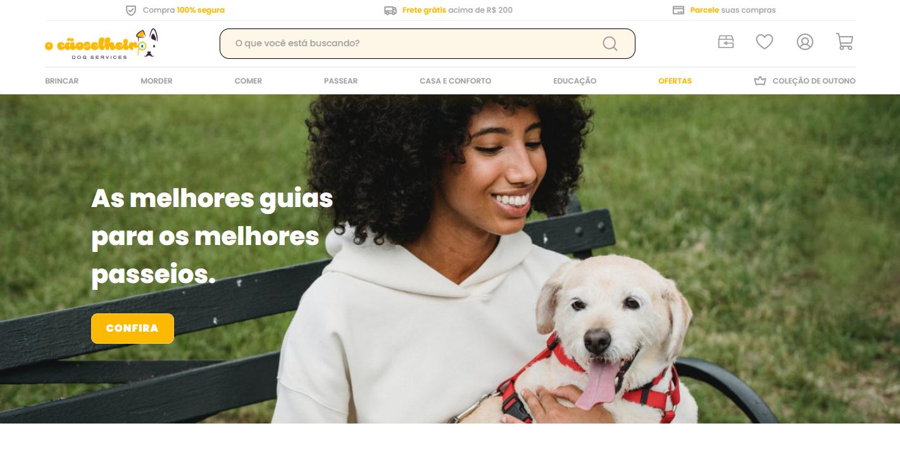

<h1 align="center">Teste Econverse</h1>

### Demonstração da aplicação
<div align="center">
  
</div>

Clique <a href="https://cardoso0.github.io/teste-front-end/" target="_blank">aqui</a> para visualizar o projeto no seu navegador

### 🎲 Rodando o projeto na sua maquina

```bash
# Clone este repositório
$ git clone https://github.com/cardoso0/teste-front-end

# Não esqueça de navegar até o pasta
$ cd teste-front-end

# Instale as dependências
$ npm install

# Execute a aplicação
Agora é só abrir no seu editor de código ou navegador.

```

### 🛠 Tecnologias

As seguintes ferramentas estão sendo usadas na construção do projeto:

- [HTML]
- [CSS com SASS]
- [JQuery]

### Autor
---
Feito com ❤️ por Felipe Cardoso 👋🏽 Entre em contato!

[](https://www.linkedin.com/in/felipe-pontes-cardoso-9b93401a0/) 
[](mailto:felipepontescardoso@yahoo.com.br)
